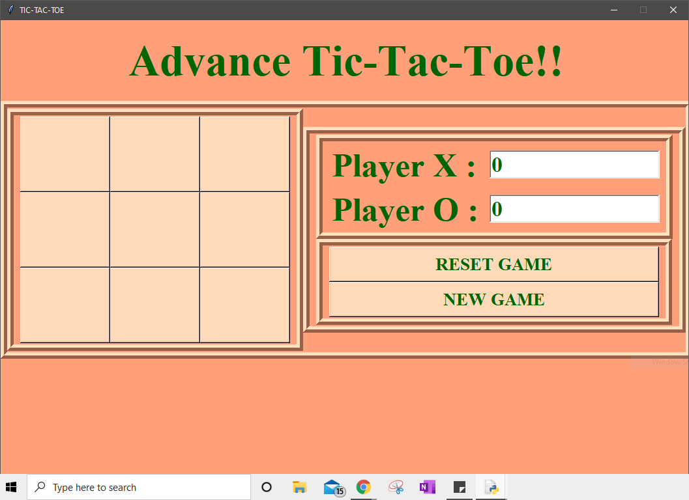
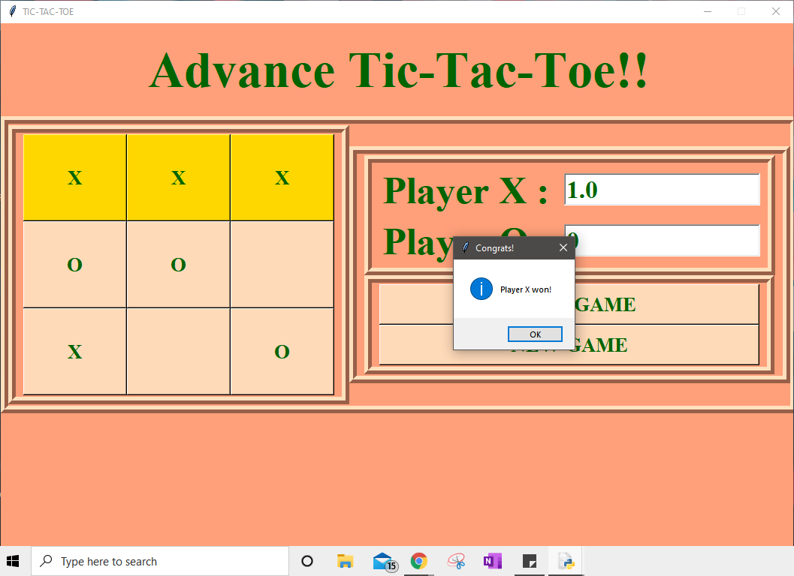
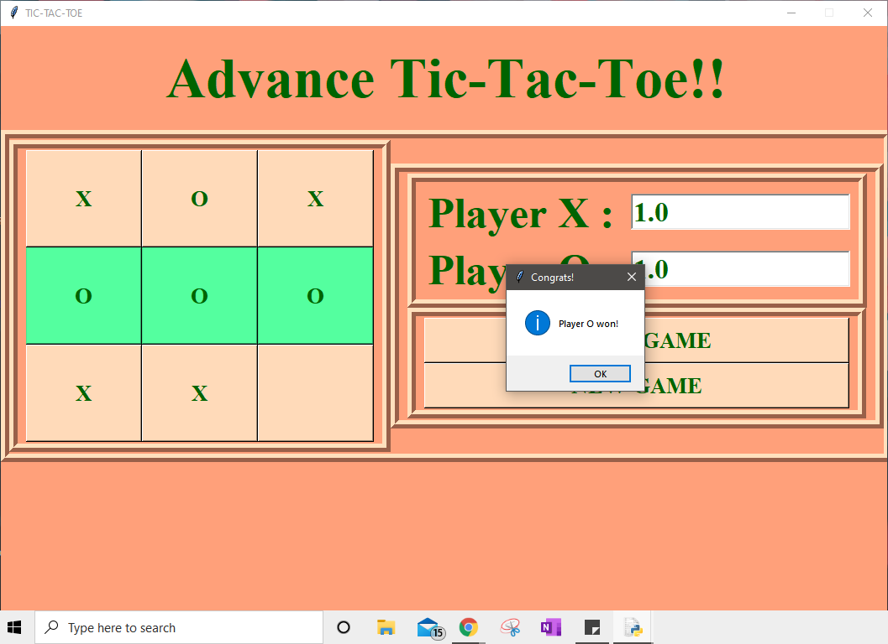

# Advance Tic-Tac-Toe
This repository is an improvised version of the [Basic Tic-Tac-Toe game](https://github.com/pallavivaswani/basic-tic-tac-toe)

# Features
Made using Tkinter, in this version players can play n number of games. 
There is Scoreboard maintained and the player is provided with an option to Reset or to start a New Game

#To Run
python advTTT.py

# Screenshots

When player X wins a match

When player O wins a match

